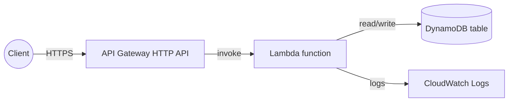

# aws-serverless-api-terraform

A clean reference for a **serverless REST API on AWS** — **Lambda** + **API Gateway (HTTP API)** +
**DynamoDB**, provisioned entirely with **Terraform**, with least-privilege IAM and a CI pipeline.
Scale-to-zero, pay-per-request, no servers to manage.

## Architecture



A simple "items" CRUD API:

| Method | Path | Action |
|--------|------|--------|
| `GET` | `/items` | List items |
| `POST` | `/items` | Create an item |
| `GET` | `/items/{id}` | Get one item |
| `DELETE` | `/items/{id}` | Delete an item |

## What this demonstrates

- Event-driven, scale-to-zero compute (Lambda) — you pay per request, not for idle servers
- A managed HTTP API (API Gateway HTTP API — cheaper/faster than REST API for most cases)
- A serverless data store (DynamoDB, on-demand billing)
- **Least-privilege IAM**: the Lambda role can touch only its own table
- Everything as code (Terraform) + a CI pipeline that tests and validates

## Layout

```
.
├── src/
│   ├── handler.py          # Lambda handler (CRUD over DynamoDB)
│   └── test_handler.py     # unit tests (mocked)
├── terraform/
│   ├── provider.tf
│   ├── variables.tf
│   ├── dynamodb.tf
│   ├── lambda.tf           # function + packaging + log group
│   ├── iam.tf              # least-privilege role/policy
│   ├── api_gateway.tf      # HTTP API + routes + integration
│   └── outputs.tf
└── .github/workflows/ci.yml
```

## Deploy

```bash
cd terraform
terraform init
terraform apply
# Terraform zips src/ and deploys the function; outputs the API URL.
curl "$(terraform output -raw api_url)/items"
```

## Test locally

```bash
cd src
pip install pytest boto3
pytest -q
```

## Security notes

- The Lambda execution role is scoped to **only** its DynamoDB table and its own log group — no
  wildcards.
- API Gateway HTTP API terminates TLS; add an authorizer (JWT/Lambda) before exposing real data.
- DynamoDB uses on-demand billing so there's nothing to over-provision.

## License

MIT
